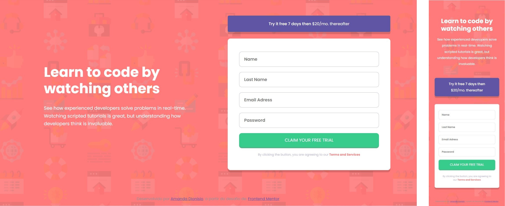

<h1 align="center">Sign up form</h1>

  

  
 

  
  
  
  

<a href="https://amandafd.github.io/signup-form/" align="center">Link da página do projeto</a>

Resolução do desafio <a href="https://www.frontendmentor.io/challenges/intro-component-with-signup-form-5cf91bd49edda32581d28fd1" alt="Link para o challenge">Intro component with sign up form challenge on Frontend Mentor</a>.
 

<ul>Conteúdos
  <li><a href="#visao-geral">Visão Geral</a> 
    <ul><li><a href="#o-desafio">O Desafio</a></li></ul>
  </li>  
  <li><a href="#meu-processo">Meu processo</a></li>
    <ul><li><a href="#aprendizados">Aprendizados</a></li></ul>
  </li>  
  <li><a href="#autora">Autora</li>
</ul>

<h2 id="visao-geral">Visão Geral</h2>

<h3 id="o-desafio">O desafio</h3>

<ul>Os usuários devem ser capazes de:
  <li>Visualizar corretamente o layout do site, dependendo do tamanho da tela do dispositivo</li>
</ul>  

<h2 id="meu-processo">Meu processo</h2>

<h3 id="aprendizados">Aprendizados</h3>

Apesar de já possuir conhecimentos de HTML e CSS, esse projeto serviu de grande aprendizado prático, fixando conceitos de construção de layouts e responsividade web

<h2 id="autora" align="left">Autora</h2>

<a href="https://github.com/amandafd">Amanda Dionisio</a>
<h3 align="left">Você me encontra nas redes sociais:</h3>

  
  
  

